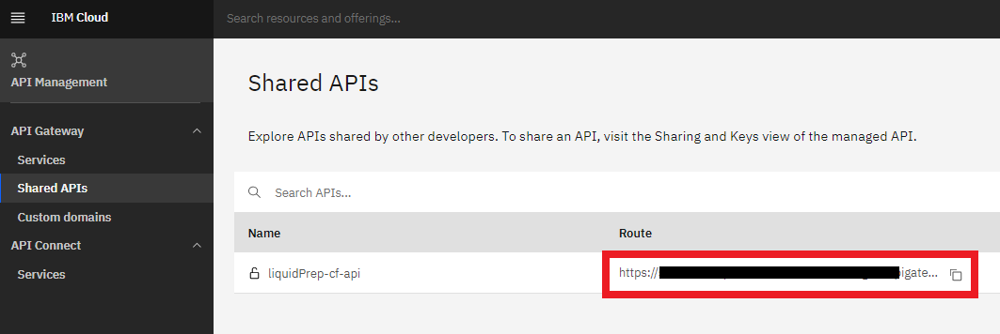

# Liquid Prep - Backend Service

Liquid Prep backend service exposes Cloud Functions API endpoints for Liquid Prep application to query weather and crop information. The backend service is deployed and hosted on IBM Cloud. It mainly consists of 2 IBM Cloud services;

1. **[IBM Cloud Functions](https://cloud.ibm.com/docs/openwhisk):** <br>

   - The Cloud Functions hosts the Liquid Prep backend service which handles the requests from Liquid Prep app, process the requests to query weather data or crop data and sends back the response to Liquid Prep app.
   - The Cloud Functions exposes an API endpoint for the Liquid Prep app to send requests to get data.

2. **[IBM Cloudant DB](https://cloud.ibm.com/docs/Cloudant):** <br>
   - The Cloudant DB acts a storage for all the crop data which will explained in the **IBM Cloudant** section.

## Setup and Deploy Backend in IBM Cloud

The first step is to setup and configure Cloud Functions and Cloudant DB in IBM Cloud. Then deploy the backend service on IBM Cloud Functions.

Please refer to the [IBM Cloud Setup and Deployment Document](SETUP.md) to get started.

## Liquid Prep APIs

Once the backend service is deployed, you can test the APIs if they are working as expected. You can test the APIs by simply calling them in any browser (Chrome, Firefox, Edge) or using CURL command or API clients like [Postman](https://www.postman.com/).

You will have to first capture the **API Host URL** from the API Management Dashboard in IBM Cloud.

<p align="middle">
  
</p>

The backend currently supports 3 APIs;

1. **GET-WEATHER-INFO:** <br>
   Get weather information for a location.

   ```text
   https://<API Host URL>/liquidprep-cf-api/get_weather_info?geoCode=<lat,long>&units=<metric/imperical>
   ```

   **Params:** <br>

   - **geoCode**: Geo-coordinates (latitude, longitude) of location.
   - **units**: metric (e) or imperial (m)

   **Example:** <br>
   Get weather information for geo-coordinates latitude 42.359, longitude 71.068 and units in metrics (e).

   ```text
   https://<API Host URL>/liquidprep-cf-api/get_weather_info?geoCode=42.359,-71.068&units=e
   ```

2. **GET-CROP-LIST:**<br>
   Get list of all the crop names and their IDs supported by Liquid Prep. <br>

   ```text
   https://<API Host URL>/liquidprep-cf-api/get_crop_list
   ```

3. **GET-CROP-INFO:**<br>
   Get a crop information supported by Liquid Prep.

   ```text
   https://<API Host URL>/liquidprep-cf-api/get_crop_info?id=<\_id>
   ```

   **Params:** <br>

   - **id**: It is the unique identity number assigned for the crop and can be obtained from list of supported crops by executing the **GET-CROP-LIST** API <br>

   **Example:** <br>
   Get crop information for Corn.

   ```text
   https://<API Host URL>/liquidprep-cf-api/get_crop_info?id=1
   ```
